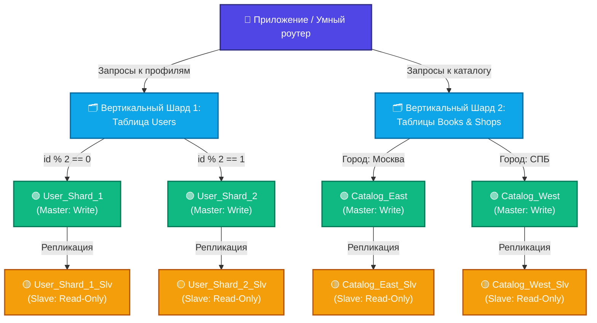

# Домашнее задание к занятию «Репликация и масштабирование. Часть 2» - Бобков Александр

<b>Задание 1.</b>

Опишите основные преимущества использования масштабирования методами:

- активный master-сервер и пассивный репликационный slave-сервер; 
- master-сервер и несколько slave-серверов;

*Дайте ответ в свободной форме.*

---

### ОТВЕТ:

Масштабирование базы данных — это процесс увеличения производительности СУБД при росте пользовательской нагрузки и объемов данных.

### 1. Активный master-сервер и пассивный репликационный slave-сервер (Master-Standby)
*   **Высокая отказоустойчивость (High Availability):** При выходе из строя основного `Master`-сервера, пассивный `Slave` (находящийся в режиме ожидания) автоматически или вручную переводится в статус ведущего. Простой системы и потери данных минимальны.
*   **Безопасное создание бэкапов:** Процесс резервного копирования создает высокую нагрузку на дисковую подсистему и может блокировать таблицы. Снятие бэкапов с пассивного сервера полностью разгружает `Master`, не мешая конечным пользователям.
*   **Простота интеграции:** Приложение работает с одной точкой подключения на чтение и запись. Нет необходимости усложнять архитектуру кода сложной логикой динамической маршрутизации запросов.

### 2. Master-сервер и несколько slave-серверов (Read-Scalability Pattern)
*   **Горизонтальное масштабирование чтения:** Нагрузка от тяжелых запросов выборки (`SELECT`) распределяется между несколькими `Slave`-серверами. Это кратно повышает общую пропускную способность системы, так как в веб-приложениях чтение обычно преобладает над записью.
*   **Изоляция аналитических процессов (BI):** Один из реплика-серверов можно выделить исключительно под тяжелое построение отчетов и аналитики. Сложные аналитические запросы не будут замедлять работу пользователей на основном сайте.
*   **Повышенная отказоустойчивость пула чтения:** Выход из строя одной реплики не нарушает работоспособность системы — трафик на чтение автоматически перераспределяется между оставшимися `Slave`-серверами.

------
------

<b>Задание 2.</b>

Разработайте план для выполнения горизонтального и вертикального шаринга базы данных. База данных состоит из трёх таблиц: 

- пользователи, 
- книги, 
- магазины (столбцы произвольно). 

Опишите принципы построения системы и их разграничение или разбивку между базами данных.

*Пришлите блоксхему, где и что будет располагаться. Опишите, в каких режимах будут работать сервера.* 
------

### ОТВЕТ:

Исходная база данных состоит из трех таблиц: `users` (пользователи), `books` (книги), `shops` (магазины). 

### 1. Вертикальный шардинг (Разделение по функциональным таблицам)
Данные разделяются по разным физическим серверам на основе бизнес-логики:
*   **БД Пользователей (`User_DB`):** Хранит таблицу `users`. Обрабатывает регистрацию, сессии и профили.
*   **БД Каталога (`Catalog_DB`):** Хранит таблицы `books` и `shops`. Обрабатывает поиск товаров и складские остатки.

### 2. Горизонтальный шардинг (Сегментирование строк таблиц)
Для распределения строк внутри таблиц применяются следующие правила:
*   **Таблица `users` (Hash-sharding по ID):**
    *   Если `id % 2 == 0` → данные направляются на **User_Shard_1**.
    *   Если `id % 2 == 1` → данные направляются на **User_Shard_2**.
*   **Таблицы `books` и `shops` (Algorithmic / Geo-sharding):**
    *   Магазины и книги в г. Москва → сегмент **Catalog_East**.
    *   Магазины и книги в г. Санкт-Петербург → сегмент **Catalog_West**.

### 3. Графическая блок-схема архитектуры

### 4. Режимы работы серверов
*   **Режим Master (Read-Write):** Принимает все модифицирующие запросы (`INSERT`, `UPDATE`, `DELETE`) от приложения. Является первоисточником данных.
*   **Режим Slave (Read-Only):** Находится в режиме постоянной потоковой асинхронной репликации. Принимает исключительно запросы на чтение (`SELECT`), разгружая основной сервер.

---

-------
-------
