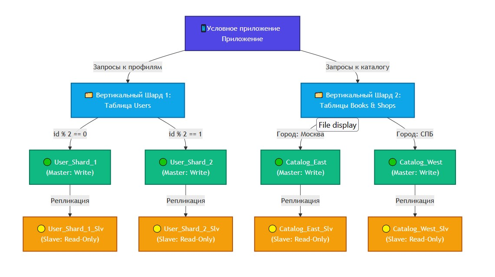

# Домашнее задание к занятию «Репликация и масштабирование. Часть 2» - Бобков Александр


<details>
<summary><b>Задание 1.</b></summary>


Опишите основные преимущества использования масштабирования методами:

- активный master-сервер и пассивный репликационный slave-сервер; 
- master-сервер и несколько slave-серверов;


*Дайте ответ в свободной форме.*

---


### ОТВЕТ:

Масштабирование базы данных — это процесс увеличения производительности СУБД при росте пользовательской нагрузки и объемов данных.

### 1. Активный master-сервер и пассивный репликационный slave-сервер (Master-Standby)
*   **Высокая отказоустойчивость (High Availability):** При выходе из строя основного `Master`-сервера, пассивный `Slave` (находящийся в режиме ожидания) автоматически или вручную переводится в статус ведущего. Простой системы и потери данных минимальны.
*   **Безопасное создание бэкапов:** Процесс резервного копирования создает высокую нагрузку на дисковую подсистему и может блокировать таблицы. Снятие бэкапов с пассивного сервера полностью разгружает `Master`, не мешая конечным пользователям.
*   **Простота интеграции:** Приложение работает с одной точкой подключения на чтение и запись. Нет необходимости усложнять архитектуру кода сложной логикой динамической маршрутизации запросов.

### 2. Master-сервер и несколько slave-серверов (Read-Scalability Pattern)
*   **Горизонтальное масштабирование чтения:** Нагрузка от тяжелых запросов выборки (`SELECT`) распределяется между несколькими `Slave`-серверами. Это кратно повышает общую пропускную способность системы, так как в веб-приложениях чтение обычно преобладает над записью.
*   **Изоляция аналитических процессов (BI):** Один из реплика-серверов можно выделить исключительно под тяжелое построение отчетов и аналитики. Сложные аналитические запросы не будут замедлять работу пользователей на основном сайте.
*   **Повышенная отказоустойчивость пула чтения:** Выход из строя одной реплики не нарушает работоспособность системы — трафик на чтение автоматически перераспределяется между оставшимися `Slave`-серверами.

</details>

------
------


<details>
<summary><b>Задание 2.</b></summary>

Разработайте план для выполнения горизонтального и вертикального шаринга базы данных. База данных состоит из трёх таблиц: 

- пользователи, 
- книги, 
- магазины (столбцы произвольно). 

Опишите принципы построения системы и их разграничение или разбивку между базами данных.

*Пришлите блоксхему, где и что будет располагаться. Опишите, в каких режимах будут работать сервера.* 
------

### ОТВЕТ:

Исходная база данных состоит из трех таблиц: `users` (пользователи), `books` (книги), `shops` (магазины). 

### 1. Вертикальный шардинг (Разделение по функциональным таблицам)
Данные разделяются по разным физическим серверам на основе бизнес-логики:
*   **БД Пользователей (`User_DB`):** Хранит таблицу `users`. Обрабатывает регистрацию, сессии и профили.
*   **БД Каталога (`Catalog_DB`):** Хранит таблицы `books` и `shops`. Обрабатывает поиск товаров и складские остатки.

### 2. Горизонтальный шардинг (Сегментирование строк таблиц)
Для распределения строк внутри таблиц применяются следующие правила:
*   **Таблица `users` (Hash-sharding по ID):**
    *   Если `id % 2 == 0` → данные направляются на **User_Shard_1**.
    *   Если `id % 2 == 1` → данные направляются на **User_Shard_2**.
*   **Таблицы `books` и `shops` (Algorithmic / Geo-sharding):**
    *   Магазины и книги в г. Москва → сегмент **Catalog_East**.
    *   Магазины и книги в г. Санкт-Петербург → сегмент **Catalog_West**.

### 3. Графическая блок-схема архитектуры

**Блок схема:**


### 4. Режимы работы серверов
*   **Режим Master (Read-Write):** Принимает все модифицирующие запросы (`INSERT`, `UPDATE`, `DELETE`) от приложения. Является первоисточником данных.
*   **Режим Slave (Read-Only):** Находится в режиме постоянной потоковой асинхронной репликации. Принимает исключительно запросы на чтение (`SELECT`), разгружая основной сервер.

---


</details>

-------
-------

<details>
<summary><b>Задание 3*.</b></summary>

Выполните настройку выбранных методов шардинга из задания 2.

*Пришлите конфиг Docker и SQL скрипт с командами для базы данных*.


### ОТВЕТ:


### 🛠️ Структура файлов проекта

Для локального запуска необходимо создать следующую структуру файлов в рабочей директории:
```text
├── .env
├── .gitignore
├── docker-compose.yml
├── init-master-users.sql
└── init-master-catalog.sql
```

### 1. Безопасность (Файл `.env`)
Файл для хранения конфиденциальных данных (пароли и логины). **Важно:** данный файл не должен попадать в публичный Git-репозиторий.
```ini
DB_USER=admin
DB_PASSWORD=my_super_secret_password_2026
```

### 2. Исключения Git (Файл `.gitignore`)
Указывает Git игнорировать локальные конфигурационные файлы с секретами.
```text
.env
```

### 3. Конфигурация оркестрации (Файл `docker-compose.yml`)
```yaml
version: '3.8'

services:
  # --- ВЕРТИКАЛЬНЫЙ ШАРД 1: ПОЛЬЗОВАТЕЛИ (MASTER) ---
  users_db_master:
    image: postgres:15
    container_name: users_db_master
    environment:
      POSTGRES_DB: users_db
      POSTGRES_USER: \${DB_USER}
      POSTGRES_PASSWORD: \${DB_PASSWORD}
    volumes:
      - ./init-master-users.sql:/docker-entrypoint-initdb.d/init.sql
    ports:
      - "5431:5432"

  # --- ВЕРТИКАЛЬНЫЙ ШАРД 2: КАТАЛОГ КНИГ (MASTER) ---
  catalog_db_master:
    image: postgres:15
    container_name: catalog_db_master
    environment:
       POSTGRES_DB: catalog_db
      POSTGRES_USER: \${DB_USER}
      POSTGRES_PASSWORD: \${DB_PASSWORD}
    volumes:
      - ./init-master-catalog.sql:/docker-entrypoint-initdb.d/init.sql
    ports:
      - "5432:5432"

  # --- РЕПЛИКА (SLAVE) ДЛЯ ШАРДА КАТАЛОГА ---
  catalog_db_slave:
    image: postgres:15
    container_name: catalog_db_slave
    environment:
      POSTGRES_DB: catalog_db
      POSTGRES_USER: \${DB_USER}
      POSTGRES_PASSWORD: \${DB_PASSWORD}
    depends_on:
      - catalog_db_master
    command: |
      bash -c "export PGPASSWORD=\${DB_PASSWORD} && 
               rm -rf /var/lib/postgresql/data/* && 
               pg_basebackup -h catalog_db_master -D /var/lib/postgresql/data -U \${DB_USER} -v -P -RX"
    ports:
       - "5433:5432"
```

### 4. SQL Скрипты инициализации СУБД

#### Файл `init-master-users.sql` (БД Пользователей)
```sql
CREATE TABLE users (
    id SERIAL PRIMARY KEY,
    name VARCHAR(100) NOT NULL,
    email VARCHAR(100) UNIQUE NOT NULL,
    register_date TIMESTAMP DEFAULT CURRENT_TIMESTAMP
);

-- Наполнение тестовыми данными
INSERT INTO users (name, email) VALUES 
('Иван Иванов', 'ivan@example.com'),
('Анна Петрова', 'anna@example.com');
```

#### Файл `init-master-catalog.sql` (БД Каталога и настройки репликации)
```sql
-- Включение параметров генерации WAL для репликации на мастере
ALTER SYSTEM SET wal_level = 'replica';
ALTER SYSTEM SET max_wal_senders = 5;

-- Создание таблиц каталога
CREATE TABLE shops (
    id SERIAL PRIMARY KEY,
    name VARCHAR(150) NOT NULL,
    city VARCHAR(50) NOT NULL,
    address TEXT
);

CREATE TABLE books (
    id SERIAL PRIMARY KEY,
    title VARCHAR(255) NOT NULL,
    author VARCHAR(150) NOT NULL,
    price NUMERIC(10, 2),
    stock INT DEFAULT 0
);

-- Наполнение тестовыми данными
INSERT INTO shops (name, city, address) VALUES 
('Книжный Мир1', 'Москва', 'ул. Ленина, д. 10'),
('Кгижный Мир2', 'Санкт-Петербург', 'ул. Ленина, д. 20');

INSERT INTO books (title, author, price, stock) VALUES 
('Мастер и Маргарита', 'Михаил Булгаков', 550.00, 15),
('Преступление и наказание', 'Федор Достоевский', 480.00, 8);
```


<details>
<summary><b>Шпаргалка по конфигу  и проверка.</b></summary>
# 🛠️ Подробный технический разбор docker-compose.yml

Ниже приведено детальное описание каждого параметра конфигурации, развернутое понятным языком для начинающих разработчиков и DevOps-инженеров.

---

## 1. Общие глобальные параметры

*   **`version: '3.8'`**  
    Указывает версию формата файла Docker Compose. Версия `3.8` является современной и наиболее стабильной для третьей ветки спецификации. Она определяет, какие именно ключевые слова и возможности оркестрации будут доступны внутри файла.
*   **`services:`**  
    Главный родительский блок, внутри которого объявляются все наши контейнеры. В терминологии Docker Compose один изолированный контейнер (или группа его копий) называется «сервисом». В нашем проекте описано три сервиса: `users_db_master`, `catalog_db_master` и `catalog_db_slave`.

---

## 2. Разбор параметров контейнеров (на примере `users_db_master`)

Каждая строчка внутри конфигурации контейнера выполняет строго определенную задачу по управлению его жизненным циклом:

*   **`users_db_master:`**  
    Внутреннее системное имя сервиса в экосистеме Docker. По этому имени другие контейнеры, находящиеся в этой же виртуальной сети, могут обращаться к данной базе (например, реплика будет искать мастера по адресу `catalog_db_master`).
*   **`image: postgres:15`**  
    Указывает Docker, из какого официального готового шаблона (образа) нужно собрать и запустить контейнер. В данном случае скачивается СУБД PostgreSQL версии 15 из глобального облачного хранилища Docker Hub.
*   **`container_name: users_db_master`**  
    Жестко задает имя физического контейнера в вашей операционной системе. Именно это имя вы будете видеть на компьютере при вводе команды `docker ps` в терминале или в интерфейсе Docker Desktop.
*   **`environment:`**  
    Блок конфигурации переменных окружения. Это «ручки управления» и настройки, которые разработчики образа PostgreSQL заложили внутрь СУБД, чтобы её можно было настроить программно в момент запуска.
    *   `POSTGRES_DB: users_db` — автоматически создает базу данных с таким именем внутри СУБД при первом старте.
    *   `POSTGRES_USER: ${DB_USER}` — устанавливает имя главного администратора базы данных.
    *   `POSTGRES_PASSWORD: ${DB_PASSWORD}` — устанавливает пароль для этого администратора.
    *   *Примечание:* Конструкция `${...}` заставляет Docker Compose заглянуть в локальный скрытый файл `.env`, забрать значения оттуда и подставить их в конфигурацию. Это защищает конфиденциальные данные от случайного коммита на GitHub.
*   **`volumes:`**  
    Секция монтирования (проброса) дисковых пространств. Она связывает папку на вашем реальном жестком диске с папкой внутри изолированного контейнера.
    *   `./init-master-users.sql:/docker-entrypoint-initdb.d/init.sql` — связывает локальный файл инициализации с системной папкой Postgres. У PostgreSQL есть встроенная логика: любые `.sql` скрипты, попавшие в директорию `/docker-entrypoint-initdb.d/`, автоматически выполняются строго один раз при самом первом запуске контейнера. Это позволяет автоматически создавать таблицы при развертывании.
*   **`ports:`**  
    Проброс (маппинг) сетевых портов из изолированной сети Docker на ваш реальный компьютер, чтобы вы могли подключиться к базе через внешние программы (например, DBeaver или DataGrip).
    *   `"5431:5432"` — синтаксис устроен по принципу `ВНЕШНИЙ_ПОРТ:ВНУТРЕННИЙ_ПОРТ`. Внутри контейнера PostgreSQL всегда слушает стандартный порт `5432`. Поскольку у нас запускается несколько баз, они не могут занять один и тот же порт на вашем компьютере. Поэтому для первой базы мы выделяем внешний порт `5431`, для второй — `5432`, а для реплики — `5433`.

---

## 3. Специфические параметры реплики (`catalog_db_slave`)

Контейнер-реплика содержит важные дополнительные параметры для автоматизации процесса синхронизации:

*   **`depends_on:`**  
    Управляет строгим порядком запуска контейнеров. Этот параметр запрещает Docker запускать реплику до тех пор, пока контейнер мастера (`catalog_db_master`) не перейдет в статус работы. Это исключает ошибки, при которых реплика пытается подключиться к еще не запустившейся основной базе.
*   **`command: |`**  
    Переопределяет стандартную команду запуска, заложенную в образ PostgreSQL по умолчанию. Символ вертикальной черты `|` позволяет написать многострочный bash-скрипт.
*   **Разбор скрипта автоматической инициализации реплики:**
    *   `export PGPASSWORD=${DB_PASSWORD}` — временно объявляет переменную с паролем в сессии Linux внутри контейнера. Это необходимо, чтобы утилита создания бэкапа могла авторизоваться на мастере в фоновом автоматическом режиме без ручного ввода пароля в терминале.
    *   `rm -rf /var/lib/postgresql/data/*` — принудительно очищает стандартную папку хранения данных реплики перед стартом. Это обязательное условие: утилита репликации не запустится, если целевая папка не будет абсолютно пустой.
    *   `pg_basebackup` — официальная встроенная утилита PostgreSQL для создания низкоуровневых резервных копий и реплик.
    *   `-h catalog_db_master` — указывает хост (адрес) мастера, с которого нужно скачать данные.
    *   `-D /var/lib/postgresql/data` — указывает директорию, куда необходимо сохранить скачанную копию.
    *   `-U ${DB_USER}` — имя пользователя для авторизации на мастере.
    *   `-v -P` — ключи Verbose и Progress. Включают подробный вывод процесса копирования данных в логи контейнера.
    *   `-RX` — важнейшие флаги конфигурации. Они автоматически создают внутри скачанной базы управляющие файлы связи с мастером (включая режим постоянного стриминга WAL-логов `standby.signal`). Благодаря этому база запускается не как обычная копия, а как активная `Read-Only` реплика, непрерывно слушающая изменения с мастера.

# 🐧 Подробный разбор скрипта Bash для настройки репликации

Внутри файла `docker-compose.yml` в блоке реплики (`catalog_db_slave`) используется параметр `command: |`, запускающий встроенный скрипт автоматизации на языке Bash. 

Ниже разобран каждый шаг этой командной строки.

---

## Исходный код Bash-скрипта
```yaml
command: |
  bash -c "export PGPASSWORD=\${DB_PASSWORD} && 
           rm -rf /var/lib/postgresql/data/* && 
           pg_basebackup -h catalog_db_master -D /var/lib/postgresql/data -U \${DB_USER} -v -P -RX"
```

---

## Пошаговый разбор команд bash 

### 1. Оболочка `bash -c "..."`
*   **Что делает:** Запускает командный интерпретатор Bash (командную строку Linux) внутри контейнера и передает ему на выполнение строку с командами в кавычках.
*   **Зачем нужно:** По умолчанию контейнер умеет выполнять только одну команду. С помощью `bash -c` мы можем объединить несколько разных команд в одну цепочку.

### 2. Разделитель `&&` (Логическое И)
*   **Что делает:** Связывает команды между собой. 
*   **Зачем нужно:** Символ `&&` гарантирует строгую последовательность: следующая команда запустится **только в том случае**, если предыдущая выполнилась успешно (вернула код 0). Если на каком-то шаге произойдет ошибка, скрипт сразу остановится, не ломая базу дальше.

### 3. Команда `export PGPASSWORD=${DB_PASSWORD}`
*   **Что делает:** Создает системную переменную окружения `PGPASSWORD` внутри контейнера и записывает в неё пароль из файла `.env`.
*   **Зачем нужно:** Утилиты PostgreSQL (такие как `pg_basebackup`) по соображениям безопасности не позволяют передавать пароль открытым текстом в виде аргумента (например, нельзя написать `-p password`). Если переменная `PGPASSWORD` существует в системе, утилита автоматически возьмет пароль из неё и **не будет запрашивать ввод пароля вручную в терминале**. Это позволяет скрипту работать полностью автоматически без участия человека.

### 4. Команда `rm -rf /var/lib/postgresql/data/*`
*   **Что делает:** Принудительно и без предупреждения удаляет абсолютно все файлы и папки из рабочей директории базы данных внутри контейнера реплики.
    *   `rm` — команда удаления (remove).
    *   `-r` — рекурсивное удаление (удалять папки вместе со всем содержимым внутри).
    *   `-f` — игнорировать несуществующие файлы и никогда не запрашивать подтверждение (force).
    *   `/*` — удалить всё содержимое, но оставить саму папку `data` на месте.
*   **Зачем нужно:** При первом запуске Docker автоматически создает в этой папке пустую структуру базы данных. Однако утилита `pg_basebackup` имеет жесткое правило: **целевая папка для реплики должна быть абсолютно пустой**. Если там будет хоть один файл, процесс репликации завершится ошибкой.

### 5. Команда `pg_basebackup -h catalog_db_master ...`
*   **Что делает:** Запускает процесс низкоуровневого копирования всех файлов базы данных с Мастера на Реплику.
*   **Разбор флагов (ключей) команды:**
    *   **`-h catalog_db_master`** (Host) — указывает сетевой адрес Мастера. Docker Compose автоматически сопоставляет имя сервиса `catalog_db_master` с нужным IP-адресом внутри сети Docker.
    *   **`-D /var/lib/postgresql/data`** (Directory) — указывает, куда именно сохранить скачанную копию (в ту самую очищенную папку).
    *   **`-U ${DB_USER}`** (User) — имя системного пользователя для авторизации на Мастере (берется из `.env`).
    *   **`-v`** (Verbose) — включает подробный режим логирования. В консоль Docker будут выводиться текстовые сообщения о каждом этапе копирования.
    *   **`-P`** (Progress) — включает отображение прогресс-бара в логах (показывает, сколько процентов данных уже скачалось).
    *   **`-R`** (Write Recovery Conf) — важнейший флаг. Он автоматически создает внутри скачанной папки сигнальный файл `standby.signal` (для Postgres 12+) и прописывает параметры подключения к Мастеру. Без этого флага база запустится как обычная изолированная копия, а с ним — как зависимая **Read-Only реплика**.
    *   **`-X stream`** (в составе флага `-RX`) — заставляет реплику открыть постоянное сетевое соединение с Мастером для непрерывного стриминга WAL-логов (журнала изменений). Благодаря этому реплика будет получать новые данные с Мастера в режиме реального времени.

# 🗄️ Подробный разбор SQL-скриптов инициализации баз данных

При первом запуске проекта Docker автоматически выполняет файлы `init-master-users.sql` и `init-master-catalog.sql`. Ниже приведено детальное описание каждой SQL-команды и структуры таблиц.

---

## 1. Разбор файла `init-master-users.sql` (БД Пользователей)

Этот скрипт отвечает за создание структуры таблиц на вертикальном шарде пользователей.

```sql
CREATE TABLE users (
    id SERIAL PRIMARY KEY,
    name VARCHAR(100) NOT NULL,
    email VARCHAR(100) UNIQUE NOT NULL,
    register_date TIMESTAMP DEFAULT CURRENT_TIMESTAMP
);
```

*   **`CREATE TABLE users`** — команда создания новой таблицы с именем `users`.
*   **`id SERIAL PRIMARY KEY`** — создание уникального идентификатора строки.
    *   `SERIAL` — специальный тип данных в PostgreSQL, который автоматически увеличивает число на +1 при добавлении каждого нового пользователя (автоинкремент: 1, 2, 3...).
    *   `PRIMARY KEY` (Первичный ключ) — указывает, что это главное поле таблицы. Оно гарантирует, что ID никогда не будут повторяться, и позволяет СУБД мгновенно находить строку по её ID.
*   **`name VARCHAR(100) NOT NULL`** — поле для хранения имени.
    *   `VARCHAR(100)` — строка переменной длины, где 100 — это максимальное количество символов. Если имя короткое, база не будет тратить лишнюю память.
    *   `NOT NULL` — запрещает оставлять это поле пустым. Приложение выдаст ошибку, если попытаться создать пользователя без имени.
*   **`email VARCHAR(100) UNIQUE NOT NULL`** — поле для хранения почты.
    *   `UNIQUE` (Уникальный индекс) — важнейший параметр безопасности. Он запрещает регистрировать двух пользователей с одинаковой почтой. База данных сама заблокирует дубликат на системном уровне.
*   **`register_date TIMESTAMP DEFAULT CURRENT_TIMESTAMP`** — поле даты регистрации.
    *   `TIMESTAMP` — тип данных, хранящий дату и время с точностью до секунд.
    *   `DEFAULT CURRENT_TIMESTAMP` — указывает базе данных автоматически подставлять текущее системное время компьютера в момент создания строки, если приложение не передало дату вручную.

```sql
INSERT INTO users (name, email) VALUES 
('Иван Иванов', 'ivan@example.com'),
('Анна Петрова', 'anna@example.com');
```
*   **`INSERT INTO ... VALUES`** — команда наполнения таблицы тестовыми (демо) данными. Мы передаем только `name` и `email`, а поля `id` и `register_date` заполняются базой данных автоматически благодаря параметрам `SERIAL` и `DEFAULT`.

---

## 2. Разбор файла `init-master-catalog.sql` (БД Каталога)

Этот скрипт не только создает таблицы книг и магазинов, но и подготавливает `Master`-сервер к тому, чтобы он мог отдавать данные на `Slave`-реплику.

### Системные настройки репликации (Важно!)
```sql
ALTER SYSTEM SET wal_level = 'replica';
ALTER SYSTEM SET max_wal_senders = 5;
```
*   **`ALTER SYSTEM SET`** — команда, которая меняет глобальные конфигурационные файлы PostgreSQL (`postgresql.conf`) прямо через SQL-запросы, без необходимости лезть в файлы операционной системы.
*   **`wal_level = 'replica'`** — переводит журнал изменений (Write-Ahead Log) в режим репликации. По умолчанию Postgres пишет в журнал минимум информации. Режим `'replica'` заставляет его записывать в WAL-лог абсолютно все детали, необходимые реплике для точного повторения действий за Мастером.
*   **`max_wal_senders = 5`** — устанавливает максимальное количество реплик, которые могут одновременно подключиться к этому Мастеру и скачивать с него логи. Мы поставили запас в 5 потоков (у нас используется 1).

### Таблица магазинов (`shops`)
```sql
CREATE TABLE shops (
    id SERIAL PRIMARY KEY,
    name VARCHAR(150) NOT NULL,
    city VARCHAR(50) NOT NULL,
    address TEXT
);
```
*   **`city VARCHAR(50) NOT NULL`** — поле города. Именно по этому полю мы планируем делать **горизонтальный шардинг** (разделять данные на Москву и СПБ).
*   **`address TEXT`** — тип данных `TEXT` используется для хранения длинных строк (адресов, описаний, статей). В отличие от `VARCHAR(150)`, он не имеет жесткого ограничения по количеству символов и динамически подстраивается под любой длинный текст.

### Таблица книг (`books`)
```sql
CREATE TABLE books (
    id SERIAL PRIMARY KEY,
    title VARCHAR(255) NOT NULL,
    author VARCHAR(150) NOT NULL,
    price NUMERIC(10, 2),
    stock INT DEFAULT 0
);
```
*   **`price NUMERIC(10, 2)`** — поле для хранения цены. 
    *   Для денег **категорически нельзя** использовать типы с плавающей точкой (типа `FLOAT`), так как они округляют копейки с ошибками. 
    *   `NUMERIC(10, 2)` гарантирует идеальную точность: `10` — общее количество цифр в числе, а `2` — сколько из них идет после запятой (копейки). То есть максимальная цена книги может быть `99999999.99`.
*   **`stock INT DEFAULT 0`** — остаток книг на складе.
    *   `INT` (Integer) — целое число для подсчета штук.
    *   `DEFAULT 0` — если мы добавляем новую книгу, но еще не завезли её на склад, база автоматически запишет, что её осталось `0` штук, вместо пустого значения (`NULL`).

* **Как проверить работоспообность:**
# 🦫 Инструкция по проверке репликации через DBeaver

Так как мы пробросили порты из Docker наружу, мы можем подключиться к трем разным базам данных прямо с твоего компьютера.

## 📌 Данные для подключения (Connection Settings)

В DBeaver нажми кнопку **"Новое соединение"** (значок розетки с плюсом) -> выбери **PostgreSQL** и создай три разных подключения со следующими параметрами:

1.  **База Пользователей (Master)**
    *   **Host:** `localhost` (или IP-адрес твоего удаленного сервера)
    *   **Port:** `5431`
    *   **Database:** `users_db`
    *   **Username:** `admin` (значение из твоего файла `.env`)
    *   **Password:** `my_super_secret_password_2026` (значение из `.env`)

2.  **База Каталога (Master)**
    *   **Host:** `localhost`
    *   **Port:** `5432`
    *   **Database:** `catalog_db`
    *   **Username:** `admin`
    *   **Password:** `my_super_secret_password_2026`

3.  **База Каталога (Slave / Реплика)**
    *   **Host:** `localhost`
    *   **Port:** `5433`
    *   **Database:** `catalog_db`
    *   **Username:** `admin`
    *   **Password:** `my_super_secret_password_2026`

---

## 🧪 Тест 1. Проверяем вертикальный шардинг

1. Открой **Базу Пользователей (порт 5431)**, открой SQL-редактор и выполни:
   ```sql
   SELECT * FROM users;
   ```
   *Вы увидите таблицу с пользователями. Если здесь же попробовать написать `SELECT * FROM books;`, база выдаст ошибку, так как этой таблицы тут нет — вертикальный шардинг работает.*

2. Открой **Базу Каталога Master (порт 5432)** и выполни:
   ```sql
   SELECT * FROM books;
   ```
   *Вы увидите список книг, но таблицы `users` здесь не будет.*

---

## 🧪 Тест 2. Проверяем работу репликации в реальном времени

Теперь проверим, как данные перелетают с Мастера Каталога на его Реплику.

1. Открой SQL-редактор для **Каталога-Мастера (порт 5432)** и добавь новую книгу:
   ```sql
   INSERT INTO books (title, author, price, stock) 
   VALUES ('Игрок', 'Федор Достоевский', 420.00, 5);
   ```

2. Сразу же переходи в SQL-редактор **Каталога-Реплики (порт 5433)** и сделай выборку:
   ```sql
   SELECT * FROM books;
   ```
   *Вы увидите, что новая книга «Игрок» уже появилась на реплике! Синхронизация произошла мгновенно.*

---

## 🧪 Тест 3. Проверяем режим Read-Only на Реплике

Реплика должна только отдавать данные, но не принимать изменения от пользователей.

1. Находясь в SQL-редакторе **Каталога-Реплики (порт 5433)**, попробуй принудительно вставить туда строку:
   ```sql
   INSERT INTO books (title, author) VALUES ('Запрещенная книга', 'Аноним');
   ```

2. Внизу экрана DBeaver ты увидишь ошибку в консоли:
   `⚠️ ERROR: cannot execute INSERT in a read-only transaction`
   
*Это финальное доказательство: Мастер принимает записи, Реплика мгновенно их подтягивает, но сама защищена от изменений.*


</details>


</details>
